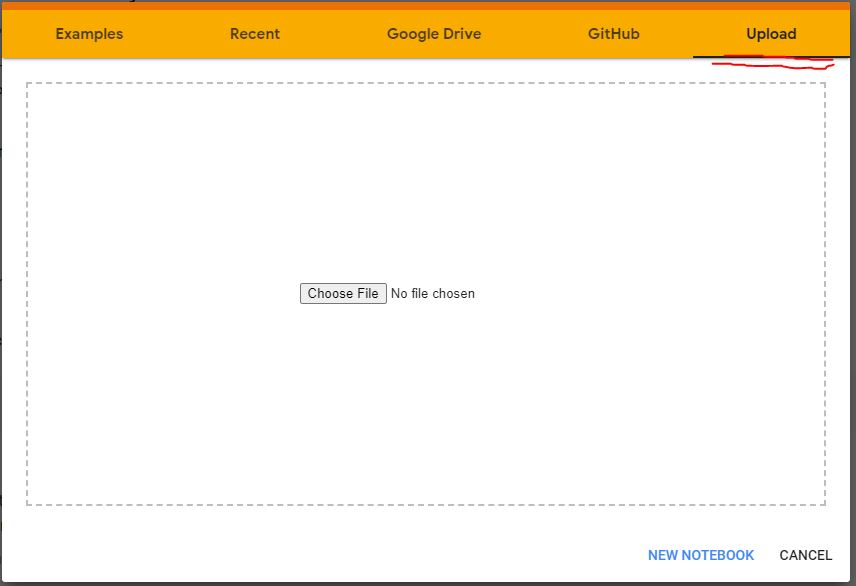
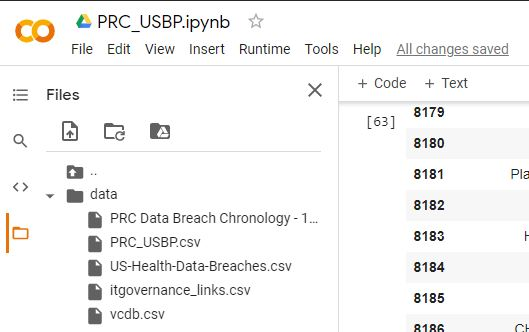

# SCSE20-0569 Open Source Intelligence Gathering and Analysis of Cyber Attack Trends
## Introduction

A final year project that demonstrate techniques of OSINT to gather data and perform data analysis to predict  different cyber-attacks trends.

## Installation
All codes are written using python3.7 and Jupyter Notebook/Google Colab

Using Google Colab:
- No additional installation required, upload ipynb file to Google Colab

- Create new folder in Google Colab, drag and drop files in  "data" folder into newly created folder directory.

- A point to note is that vcdb.csv is over 100MB, which will take a while to upload into Google Colab.

Using Jupyter Notebook:
-Lauch .ipynb in Jupyter Notebook
> NLP.ipynb codes does not run on Jupyter Notebook due to modules conflict.

 

## Usage
PRC_USBP.ipynb - Data processing of "PRC Data Breach Chronology - 1.13.20.csv" and "US-Health-Data-Breaches.csv"
- Input : PRC Data Breach Chronology - 1.13.20.csv, US-Health-Data-Breaches.csv,itgovernance_links.csv
- Output: PRC_USBP.csv, governance_link.csv

vcdb.ipynb - Data processing of vcdb.csv and final analysis done after concatenation of other sources
- Input : vcdb.csv, PRC_USBP.csv
- Output: final_repo.csv

NLP.ipynb - Executes only in Google Colab due to module support conflicts.
- Input : itgovernance_links.csv
- Output: governance_link.csv
